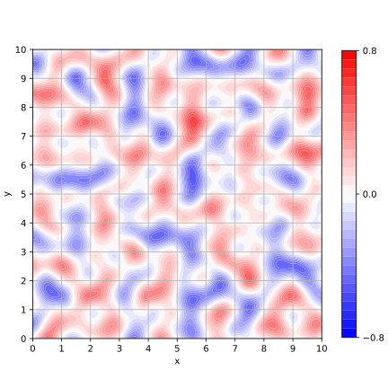

# A Perlin noise

## Overview

This is a Perlin noise implementation in python.  
It is used in my blog about Perlin noise.  

[Take it easy with Perlin Noise(Classic)](https://sioramen.sub.jp/blog2/en/2025/01/12/take-it-easy-with-perlin-noiseclassic/)  

[ゆっくりPerlin Noise(Classic)していってね](https://sioramen.sub.jp/blog2/2024/12/15/%e3%82%86%e3%81%a3%e3%81%8f%e3%82%8aperlin-noise%e3%81%97%e3%81%a6%e3%81%84%e3%81%a3%e3%81%a6%e3%81%ad/)  

## Requirement

It runs on Pyhton 3 and Linux. It hasn't been confirmed to run on Windows.  
The python modules Numpy, Matplotlib and Mayavi are required.  

## Usage

When used in a command terminal  
$ python3 ./perlin1d.py  
$ python3 ./perlin2d.py  
$ python3 ./perlin3d.py  

Or in a Python program, used as a module   
...  
from perlin1d import *  
from perlin2d import *  
from perlin3d import *  
v1=perin1d(0.5)  
v2=perin2d(0.5,0.5)  
v3=perin3d(0.5,0.5,0.5)  

## Reference

[Noise and Turbulence](https://web.archive.org/web/20160503105316/http://mrl.nyu.edu/~perlin/doc/oscar.html)  

## Author

masahito3  

## License

MIT license.  

## Disclaimer

This software is provided 'as is' without any express or implied warranties, including but not limited to warranties of merchantability or fitness for a particular purpose. The user accepts full responsibility for any damages, losses or liabilities resulting from its use.

